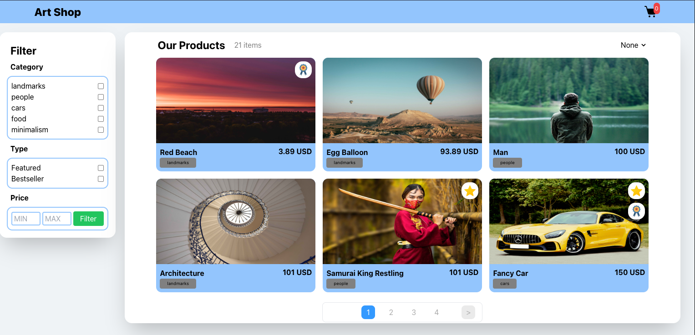

# Art Shop application



Pretty simple e-commerce app where you can filter, sort and add products to cart.

This project was bootstrapped with [Create React App](https://github.com/facebook/create-react-app).

### For this project I have used these technologies:

- [React](https://reactjs.org/)
- [TypeScript](https://www.typescriptlang.org/)
- [Sass](https://sass-lang.com/)
- [Tailwind](https://tailwindui.com/)

## How to start

#### Intall [Node.js](https://nodejs.org/en/)

#### Download project

#### In root directory run

```
npm install
```

#### Run project

```
npm start
```

## Available Scripts

In the project directory, you can run:

### `npm start`

Runs the app in the development mode.\
Open [http://localhost:3000](http://localhost:3000) to view it in the browser.
Footer
© 2022 GitHub, Inc.
Footer navigation
Terms
Privacy
Security
Status
Docs
Contact GitHub
Pricing
API
Training
Blog
About
2048/README.md at master · zagalexey/2048